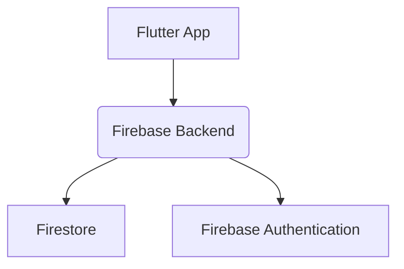
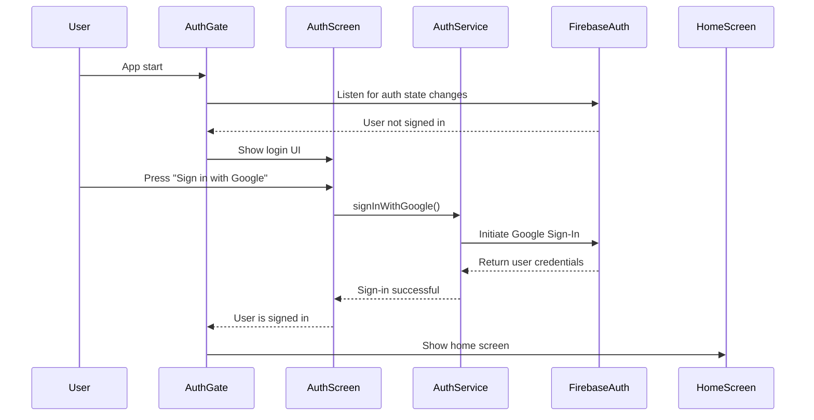
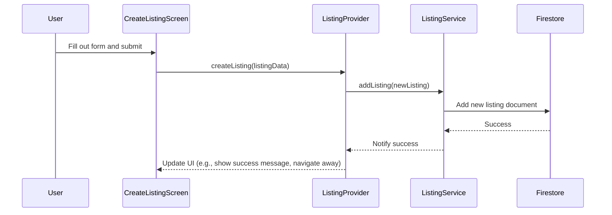

# BookBridge App: Design Document

## Overview

This document outlines the design for the BookBridge Flutter application, a mobile marketplace for students to buy and sell used books locally. This design adheres strictly to the specifications detailed in the `ARCHITECTURE.md` file.

## Detailed Analysis of the Goal

The primary goal is to create a simple, intuitive mobile application that facilitates the local exchange of used physical books. The target users are students, implying a need for a straightforward, mobile-first experience.

The core functionalities are:
- User authentication via Google Sign-In.
- Browsing a list of available book listings.
- Viewing detailed information about a specific listing.
- Creating a new listing for a book.
- Marking a listing as "sold".

The architecture explicitly defers features like in-app payments, chat, and delivery logistics, focusing solely on the discovery and connection aspects of the marketplace.

## Alternatives Considered

### State Management

- **Provider:** While a viable option, Riverpod was chosen for its compile-time safety and more granular control over state.
- **Bloc:** Bloc is a powerful and robust state management solution, but its boilerplate can be verbose for a project of this scale. Riverpod offers a more lightweight and less ceremony-intensive approach, which is well-suited for this application.

### Backend

- **Custom Backend (e.g., Node.js, Python):** A custom backend would offer more flexibility but at the cost of increased development and maintenance overhead. Firebase (Firestore, Authentication) provides a comprehensive, scalable, and cost-effective BaaS (Backend as a Service) that is ideal for this project, allowing for rapid development and iteration.

## Detailed Design

### High-Level Architecture

The application will follow a feature-driven architecture, with a clear separation of concerns between the data, domain, and presentation layers.

- **`lib/core`**: Contains application-wide utilities, constants, and error-handling logic.
- **`lib/features`**: This is the heart of the application, with each subdirectory representing a distinct feature (e.g., `auth`, `listings`, `books`).
- **`lib/shared`**: Holds widgets and services that are used across multiple features.

### Data Flow

The data flow will be unidirectional, with the UI reacting to state changes from the providers.

1. **UI (Widgets/Screens):** The user interacts with the UI, triggering events.
2. **Providers (Riverpod):** These events are dispatched to the appropriate Riverpod providers, which manage the application's state.
3. **Services:** Providers interact with services (e.g., `ListingService`) to perform business logic and data operations.
4. **Firebase:** Services communicate with Firebase for data persistence and authentication.
5. **Models:** Data is encapsulated in strongly-typed models (e.g., `Listing`, `Book`).

### Diagrams

#### High-Level Component Diagram

#### Authentication Flow

#### Creating a Listing

## Summary of the Design

This design establishes a clean, scalable, and maintainable architecture for the BookBridge Flutter app. By adhering to the feature-driven structure and the principles of Riverpod for state management, the application will be easy to extend and reason about. The strict separation of concerns ensures that the UI, business logic, and data layers remain decoupled, facilitating testing and future development.

## Research URLs

- [Riverpod Documentation](https://riverpod.dev/)
- [Firebase for Flutter](https://firebase.flutter.dev/)
- [Flutter Architectural Overview](https://docs.flutter.dev/resources/architectural-overview)
